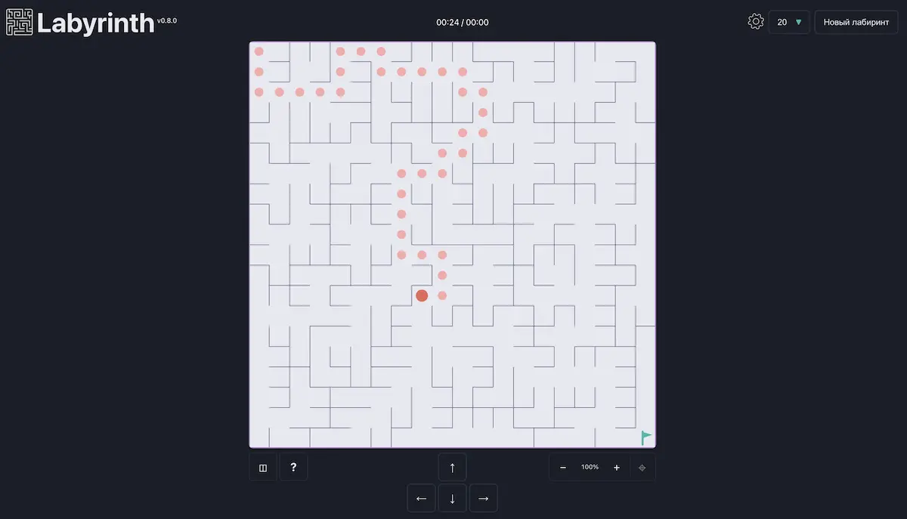

# Labyrinth

> Процедурно генерируемая PWA-игра с бесконечными лабиринтами, масштабированием, миникартой и автосохранением прогресса.

[](https://danilchugaev.github.io/labyrinth/)



## Возможности

- **Уникальный лабиринт в каждом раунде** — поле строится процедурно в Web Worker и не блокирует интерфейс.
- **Масштабирование и навигация** — кнопки, клавиатура, жест pinch-to-zoom, `Ctrl`/`Cmd` + колесо и drag-панорамирование.
- **Миникарта** для лабиринтов от `50 × 50` — показывает игрока, флаг, маршрут и текущую область просмотра.
- **Автосохранение** — при обновлении страницы или возвращении в PWA восстанавливаются лабиринт, маршрут, игрок, камера и время.
- **Статистика прохождения** — время, лучший результат, ходы, исследование поля, кратчайший маршрут и эффективность.
- **Три режима темы** — светлая, тёмная и системная.
- **Доступное управление** — клавиатура, экранные кнопки, touch-жесты, видимый focus и диалоги на нативных HTML-элементах.
- **Уважение к системным настройкам** — поддерживаются `prefers-reduced-motion` и `prefers-color-scheme`.
- **Offline-first PWA** — приложение можно установить и запускать без подключения к сети.

## Управление

| Действие | Управление |
| --- | --- |
| Перемещение | <kbd>↑</kbd> <kbd>→</kbd> <kbd>↓</kbd> <kbd>←</kbd> или экранные кнопки |
| Масштаб | <kbd>+</kbd> / <kbd>−</kbd>, pinch, <kbd>Ctrl</kbd>/<kbd>Cmd</kbd> + колесо |
| Показать поле целиком | <kbd>0</kbd> |
| Новый лабиринт | <kbd>R</kbd> |
| Показать / скрыть миникарту | <kbd>M</kbd> |
| Справка | <kbd>?</kbd> |

На touch-устройствах используйте один палец для перемещения поля и два пальца для масштабирования.

## Как это устроено

```text
main.ts
 ├─ UI-компоненты: настройки, тема, масштаб, миникарта, справка
 ├─ Canvas renderer: поле, маршрут, игрок, цель и анимации
 ├─ Viewport: zoom, pan, сохранение положения камеры
 ├─ localStorage: настройки, рекорды и незавершённая игра
 └─ Web Worker
     ├─ процедурная генерация лабиринта
     └─ поиск кратчайшего маршрута (BFS)
```

Стены клетки кодируются битовой маской в `Uint8Array`, а генерация использует приоритетную очередь. Такой формат экономит память и подходит для больших полей.

## Технологии

- TypeScript
- Vite
- Canvas 2D API
- Web Workers
- Progressive Web App / Workbox
- CSS custom properties, системная светлая и тёмная темы
- ESLint и Prettier
- GitHub Pages + GitHub Actions

## Локальный запуск

```bash
git clone git@github.com:DanilChugaev/labyrinth.git
cd labyrinth
yarn install
yarn dev
```

Откройте [http://localhost:5173/labyrinth/](http://localhost:5173/labyrinth/) в браузере. Базовый путь `/labyrinth/` соответствует публикации на GitHub Pages.

## Команды

```bash
# Проверка кода
yarn lint

# Проверка форматирования
yarn format:check

# Production-сборка
yarn build

# Локальный просмотр production-сборки
yarn preview
```

## Деплой

Проект автоматически публикуется на GitHub Pages после push в ветку `master`. Конфигурация workflow: [`.github/workflows/deploy.yml`](.github/workflows/deploy.yml).

## Лицензия

Проект распространяется по лицензии [MIT](LICENSE).
